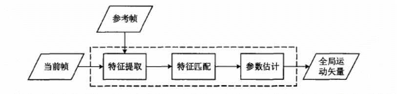
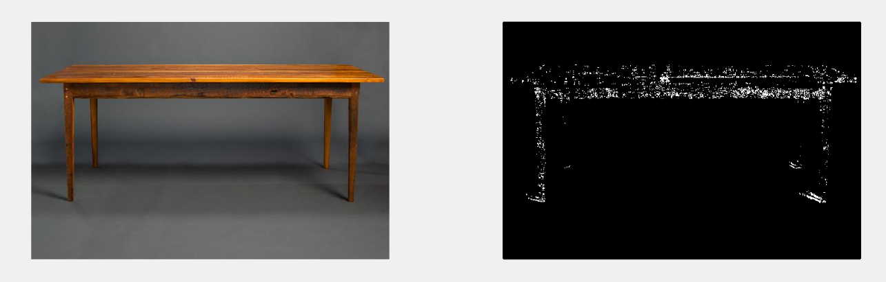
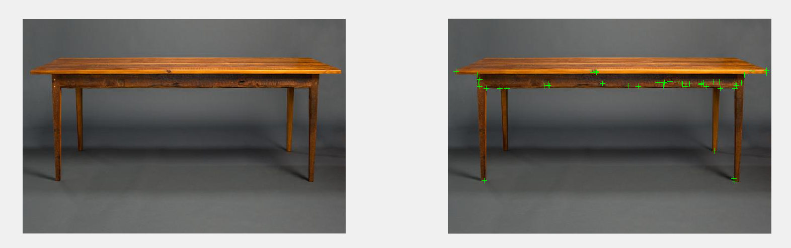
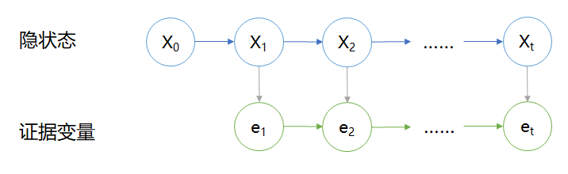
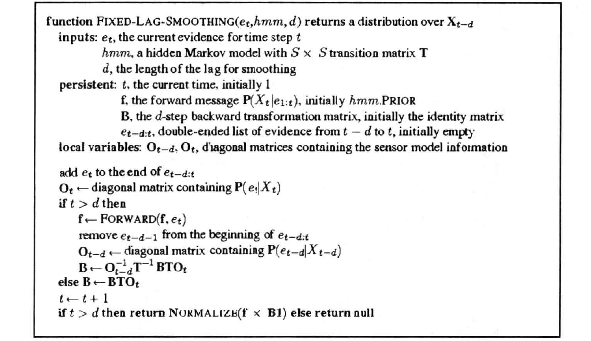
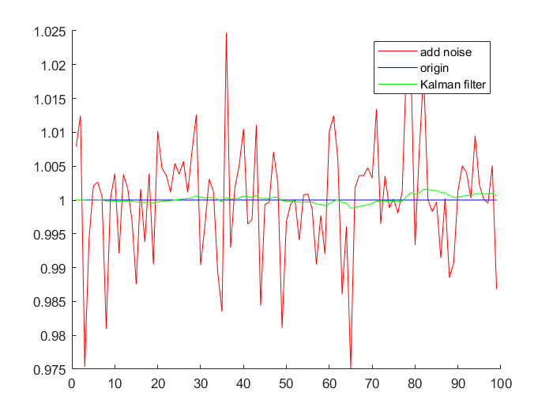
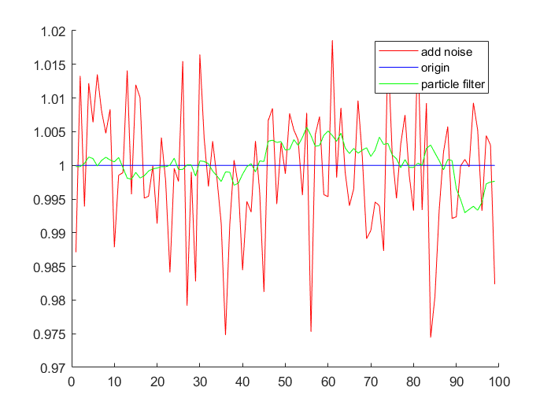

# 视频稳像 Video Stabilization


This is the final project of FDU CS:APP.

Group members: 陈幸豪, 王鹏, 王鑫, 叶涵诚, 张奕朗.

github: https://github.com/zhangyilang/videoStabilization (please download chrome plugin `GitHub with MathJax` to show all the equations)


### 前言

视频稳像想要解决的问题：由于拍摄视频时各种因素（如手抖、风吹等）引起的抖动干扰，使得摄像机发生一定的随机抖动，影响视频的质量；视频稳像的目的是对视频设备采集的原始视频序列进行处理，去除其中的抖动。

目前稳像按作用机制分为光学、机械和电子稳像：

- **光学稳像**通过主动光学部件自适应调整光路,补偿由于摄像平台抖动造成的图像运动,达到稳定图像的的目的；
- **机械稳像**通过陀螺传感器等器件检测摄像平台的抖动,然后对伺服系统进行调整而达到稳定图像的目的；
- **电子（数字）稳像**基于在连续视频图像之间进行运动估计,然后对视频中的每一帧图像进行运动滤波和运动补偿处理得到稳定的图像。

本次project要做的是利用算法完成的电子稳像。


### 整体框架

整个视频稳像分为以下五个阶段：

- 特征提取：提取出每一帧中的特征，为运动估计作准备；

  

- 运动估计：根据提取到的特征的移动估计出每相邻两帧之间的运动矩阵，包括缩放因子$S$、旋转因子$\theta$和平移向量$(T_x,T_y)$；

- 消除直流分量：运动估计得到的参数中可能会含有一定的直流分量，需要进行去除（直接减去平均值）。

  例如：拍摄者的位置或者视角一直在向左或者向前持续移动，并且在不断抖动，会造成每两帧之间的运动在一个固定偏移量的基础上发生随机抖动；

- 参数滤波：在加性高斯白噪声的建模假设下，利用滤波消除特征提取和运动估计中的噪声；

- 运动补偿：利用滤波后的参数对每一帧图像进行平移，还原出无抖动或抖动明显减小的视频。


### 特征提取：角点检测

##### Harris角点

Harris角点检测算法的思想是让一个小窗在图像中移动，通过考察这个小窗口内图像灰度的平均变换值来确定角点：

- 如果窗口内区域图像的灰度值恒定，那么所有不同方向的偏移几乎不发生变化；
- 如果窗口跨越一条边，那么沿着这条边的偏移几乎不发生变化， 但是与边垂直的偏移会发生很大的变化；
- 如果窗口包含一个孤立的点或者角点，那么所有不同方向的偏移会发生很大的变化。

对于图像$I\left( x,y \right) $，当在点$\left( x,y \right) $处平移$\left( u,v \right) $后的自相似性,可以用灰度变化函数$E\left( u,v \right) $表示，其中，$w\left( x,y \right) $是以点$\left( x,y \right) $为中心的窗口，$w\left( u,v \right) $为加权函数，它既可是常数，也可以是高斯加权函数。
$$
E\left( u,v \right) =\underset{x,y}{\varSigma}w\left( x,y \right) \left[ I\left( x+u,y+v \right) -I\left( x,y \right) \right] ^2
$$
对$I\left( x+u,y+v \right) $进行泰勒展开，得到下式，其中$I_x$和$I_y$为$I(x,y)$的偏导。
$$
I\left( x+u,y+v \right) =I\left( x,y \right) +I_xu+I_yv+O\left( u^2,v^2 \right)
$$
最后我们可以推导得出:
$$
M=\underset{x,y}{\varSigma}w\left( x,y \right) \left[ \begin{matrix}

​       I_{x}^{2}&         I_xI_y\\

​       I_xI_y&        I_{y}^{2}\\

\end{matrix} \right]
$$
M可以看作一个椭圆函数，椭圆的扁平率和尺寸是由矩阵M的两个特征值$\lambda _1$、$\lambda _2$决定的。椭圆函数特征值与图像中的角点、直线（边缘）和平面之间的关系可分为三种情况：

- 图像中的直线。一个特征值大，另一个特征值小，**$\lambda_1>>\lambda_2$**或者**$\lambda_1<<\lambda_2$**。自相关函数值在某一方向上大，在其他方向上小。
- 图像中的平坦区域。两个特征值都小，且近似相等；自相关函数数值在各个方向上都小。
- 图像中的角点。两个特征值都大，且近似相等，自相关函数在所有方向都增大。

根据二次项函数特征值的计算公式，我们可以求矩阵的特征值。但是Harris给出的角点差别方法并不需要计算具体的特征值，而是计算一个角点的响应值R来判断角点。R的计算公式为：
$$
R=\det M-k\left( traceM \right) ^2
$$
$k$为经验常数$0.04~0.06$。当$R>threshold$时且为局部极大值的点时，定义为角点。Harris角点检测算子对图像亮度和对比度具有部分不变性，且具有旋转不变性，但不具有尺度不变性。


##### Shi-Tomasi角点

Shi-Tomasi算法是Harris算法的改进，在Harris算法中，是根据协方差矩阵M的两个特征值的组合来判断是否角点。而在Shi-Tomasi算法中，是根据较小的特征值是否大于阈值来判断是否角点。 

Shi-Tomasi算法判断依据是：较小的特征值表示在该特征值方向上的方差较小，较小的方差如果都能够大于阈值，那么在这个方向上的变化则满足是角点的判断要求。 

协方差矩阵M如下表示：
$$
M=\underset{x,y}{\varSigma}w\left( x,y \right) \left[ \begin{matrix}

​       I_{x}^{2}&         I_xI_y\\

​       I_xI_y&        I_{y}^{2}\\

\end{matrix} \right]
$$
这里我们需要关心的是，如何求解矩阵M的特征值。

求解特征值，一般求解这样的一个$\lambda$，使得: 
$$
\det \left( \lambda I-A \right) =0
$$
对于A这样一个2x2矩阵来说，我们可以分解为： 
$$
\det \left( \lambda \left[ \begin{matrix}

​       1&         0\\

​       0&         1\\

\end{matrix} \right] -A \right) =\det \left( \left[ \begin{matrix}

​       \lambda&          0\\

​       0&         \lambda\\

\end{matrix} \right] -\left[ \begin{matrix}

​       a&         b\\

​       c&         d\\

\end{matrix} \right] \right) =0
$$

$$
\left( \lambda -a \right) \left( \lambda -c \right) -bd=\lambda ^2-\left( a+c \right) \lambda +ac-bd
$$

根据求根公式，有： 
$$
\lambda =\frac{\left( a+c \right) \pm \sqrt{\left( a+c \right) ^2-\text{4（}ac-bd\text{）}}}{2}=\frac{\left( a+c \right) \pm \sqrt{\left( a-c \right) ^2\pm 4bd}}{2}
$$
带入具体的M，较小的特征值为： 
$$
R=\frac{\left( \varSigma I_x^2+\varSigma I_y^2 \right) -\sqrt{\left( \varSigma I_x^2-\varSigma I_y^2 \right) ^2+4\left( \varSigma I_xI_y \right) ^2}}{2}
$$
Shi-Tomasi算法定义的角点响应函数为：
$$
R=\min \left( \lambda _1,\lambda _2 \right)
$$
如果R超过阈值，我们就认为它是一个角点。我们可以把它绘制到$\lambda_1\sim\lambda_2$空间中，只有当$\lambda_1$和$\lambda_2$都大于最小值时，才被认为是角点。


##### 角点算法实现

根据上述讨论，可以将Harris和Shi-Tomasi图像角点检测算法归纳如下，共分为以下五步：

1. 计算图像$I(x,y)$在X和Y两个方向的梯度$I_x$、$I_y$。

$$
I_x=\frac{\partial I}{\partial x}=I\otimes \left( -\text{1 0 }1 \right) ,I_y=\frac{\partial I}{\partial x}=I\otimes \left( -\text{1 0 }1 \right) ^T计算图像两个方向梯度的乘积。
$$

2. 计算图像两个方向梯度的乘积。

$$
I_x^2=I_x\cdot I_x,I_y^2=I_y\cdot I_y,\boldsymbol{I}_{\boldsymbol{xy}}=I_x\cdot I_{\boldsymbol{y}}
$$

3. 使用高斯函数对$I_x^2$、$I_y^2$和$I_{xy}$进行高斯加权（取$\sigma =1$），生成矩阵M的元素A,B和C。

$$
A=g\left( I_x^2 \right) =I_x^2\otimes w,C=g\left( I_y^2 \right) =I_y^2\otimes w,B=g\left( I_{xy} \right) =I_{xy}\otimes w
$$

4、 对于Harris算法计算每个像素的角点响应值R，并对于某一阈值t的R置为零。
$$
R=\left\{ R=\det M-k\left( traceM \right) ^2<t \right\}
$$
对于Shi-Tomasi算法计算的R：
$$
R=\frac{\left( \varSigma I_x^2+\varSigma I_y^2 \right) -\sqrt{\left( \varSigma I_x^2-\varSigma I_y^2 \right) ^2+4\left( \varSigma I_xI_y \right) ^2}}{2}
$$
5、 在$3\times3$和$5\times5$的邻阈内进行非最大值抑制，局部最大值点即为图像中的角点。

 

##### 算法效果展示





   

###  运动估计


### 参数滤波

由于特征提取和参数估计得到的结果不够准确，存在一定的噪声，需要进行一定的修正。假设特征提取和参数估计无偏，根据大数定理，每一帧估计噪声的累加影响可建模为零均值的加性高斯白噪声。由此，结合HMM模型，可将由隐状态获得观测值的过程建模为一个线性高斯过程。


##### 模型建立与算法选取



抖动参数（包括缩放、平移和旋转）的变化被建模为一个一阶隐马尔可夫过程，转移概率$P(X_{t+1}\mid X_t)$被建模为线性高斯变化过程；由**概述**中的分析知：观察的过程，即发射概率$P(e_t\mid X_t)$也被建模为一个高斯过程。

HMM有五大算法：

- 预测：转移模型

- 滤波：前向算法  
- 平滑：前向——后向算法
- 最可能序列：维特比算法
- 学习：EM算法

我们要解决的是后验概率$P(X\mid e)$的求取问题，所以可供选择的只有前向算法、前向——后向算法和维特比算法。其中，前向算法求取$P(X_t\mid e_{1:t})$适用于实时的流式数据处理，而前向——后向算法求取$P(X_k\mid e_{1:t})$和维特比算法$argmax_{X_{1:t}}P(X_{1:t}\mid e_{1:t})$适用于静态视频的后处理，实时性不够。由于项目对于实时性的要求，我们这里只能选择前向算法求解。


##### 滤波算法1：卡尔曼滤波

由于前面对于高斯分布的假设，转移概率和发射概率都被建模为一个线性高斯分布，有如下定理：

- 定理1：若当前分布$P(X_t|e_{1:t})$为高斯分布，转移模型为线性高斯分布$P(X_{t+1}\mid X_t)\sim \mathbb{N}(Fx_t,\Sigma_t)(x_{t+1})$，则单步预测

$$
P(X_{t+1}\mid e_{1:t})=\int_{x_t}P(X_t|e_{1:t})P(X_{t+1}\mid X_t)dx_t
$$

​		为高斯分布。

- 定理3：若预测分布$P(X_{t+1}\mid e_{1:t})$为高斯分布，传感器模型为线性高斯分布$P(e_{t+1}\mid X_{t+1})\sim \mathbb{N}(Hx_t,\Sigma_e)(e_t)$，则前向滤波更新后的分布

$$
P(X_{t+1}\mid e_{1:t+1})=\alpha P(X_{t+1}\mid e_{1:t})P(e_{t+1}\mid X_{t+1})
$$

​		为高斯分布。

由于高斯分布可以由均值和协方差矩阵唯一确定，所以只需要知道每个时刻隐状态的均值和协方差矩阵更新公式就可以了。由定理中的两式结合高斯假设可以推导出如下更新公式：
$$
\begin{align}
\mu_{t+1}&=F\mu_t+K(e_{t+1}-HF\mu_t)\\
\Sigma_{t+1}&=(I-K_{t+1}H)(F\Sigma_tF^H+\Sigma_x)\\
K_{t+1}&=(F\Sigma_tF^H)H^H(H(F\Sigma_tF^H)H^H+\Sigma_x)^{-1}
\end{align}
$$
其中$K_t$为卡尔曼增益矩阵。


##### 滤波算法2：粒子滤波

卡尔曼滤波虽然精确，但是由于更新公式复杂度太高，在计算资源有限的情况下（如手机）速度会跟不上，所以这里再写一个粒子滤波备用。粒子滤波拥有常数时间复杂度为$O(N)$，其中$N$为粒子的数量。其思想如下：

- 每个粒子代表一个隐状态，用粒子的分布来模拟前向算法中隐状态分布的变化，并根据观察到的证据动态地调整粒子的分布，其主要步骤为转移transition（或称为传播propagation）、重加权reweight、重采样resample；
- Transition：每个粒子按照隐状态的转移概率模型$P(X_{t+1}\mid x_t)$进行转移；
- Reweight：根据新观察到的变量$e_{t+1}$为每个粒子重新分配权重$P(e_{t+1}\mid X_{t+1})$
- Resample：根据每个粒子的权重对其重新进行采样，生成权重为1的新的$N$个粒子作为下一时刻隐状态的估计。

《Artificial Intelligence: A Modern Approach》中给出的算法伪代码如下


##### 滤波算法3：固定帧延时下的平滑

传统的前向——后向算法需要等待帧序列采集完成，适用于静态数据处理，但是当固定$n=k-t$，$n$为延迟的帧数（较小，约$3\sim5$）时，可以兼顾准确性与实时性。

《Artificial Intelligence: A Modern Approach》中给出的算法伪代码如下（矩阵形式推导见书）




##### 算法实现与仿真

用*Matlab*实现的卡尔曼滤波器用*Matlab*实现的卡尔曼滤波器仿真结果如下（见函数`smooth_Kalman.m`）：

*注：要复现的话请将函数中的参数调整为*

```matlab
trans_noise = [1e-4, 1e-4, 1e-4, 1e-4];     % variance
observe_noise = [1e-1, 1e-1, 1e-1, 1e-1];
```



粒子滤波用*Matlab*实现的卡尔曼滤波器仿真结果如下（见函数`smooth_particle.m`）：

*注：要复现的话请将函数中的参数调整为*

```matlab
trans_std = sqrt([1e-4, 1e-4, 1e-4, 1e-4]);   % variance -> standard deviation
observe_std = sqrt([1e-1, 1e-1, 1e-1, 1e-1]);
```

*并将粒子数设置为2000（粒子数为5000时效果和卡尔曼滤波差不多，但速度较慢）。*



期末时间太紧，滤波算法3来不及写了，就先咕了。


### 运动补偿


### 代码优化

这里给出可能的代码优化思路，有空可能会填坑。


##### SIMD

single instruction multiple data单指令多数据流。

- C++：可通过调用IPP、MKL等库，充分向量化数据以获得较高的并行度；

- Matlab中只要调用gpuArray就会动用SIMD进行计算。

  

##### GPU并行

由于处理的视频流每帧之间存在前后依赖性，无法并行运算（当然如果你要循环展开那当我没说），但是每帧之内的处理没有依赖性。SIMD为指令级抽象，抽象层级较高，并行粒度较粗，不能充分利用GPU多ALU的特点达到极限的并行度。

- C++：CUDA编程，GPU grid内使用multi-block+multi-thread，block和thread的数量可分别设置为输入矩阵的行数和列数，将二维坐标`(x,y)`映射到`(blockIdx.x, threadIdx.x)`，当然访问数组的时候还是要用`blockIdx.x * blockDim.x + threadIdx.x`进行索引。
- Matlab：gpuArray + parfor (matlab parallel computing toolbox)


### 参考文献

[1] J. Shi and C. Tomasi, Good Features to Track, Proceedings of the IEEE Conference on Computer Vision and Pattern Recognition, pp 593-600, June 1994.

[2] C. Harris and M. Stephens. "A Combined Corner and Edge Detector." Proceedings of the 4th Alvey Vision Conference. August 1988, pp. 147-151. 

[3] ☆Ronny丶. Harris角点. https://www.cnblogs.com/ronny/p/4009425.html.

[4] Kejriwal L, Singh I. A Hybrid filtering approach of Digital Video Stabilization for UAV using Kalman and Low Pass filter[J]. Procedia Computer Science, 2016, 93: 359-366.

[5] Whyte O, Sivic J, Zisserman A. Deblurring shaken and partially saturated images[J]. International journal of computer vision, 2014, 110(2): 185-201.

[6] Liu S, Yuan L, Tan P, et al. Bundled camera paths for video stabilization[J]. ACM Transactions on Graphics (TOG), 2013, 32(4): 78.

[7] Hee Park S, Levoy M. Gyro-based multi-image deconvolution for removing handshake blur[C]//Proceedings of the IEEE Conference on Computer Vision and Pattern Recognition. 2014: 3366-3373.

[8] hjl240. Video Stabilization. https://blog.csdn.net/hjl240/article/details/52683738.